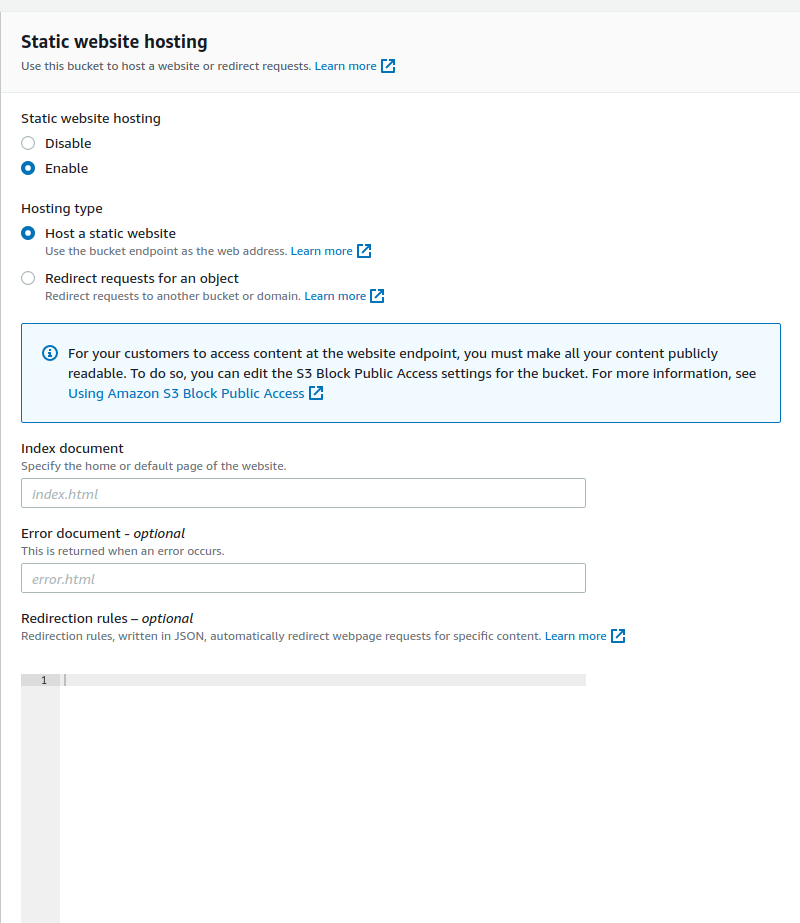
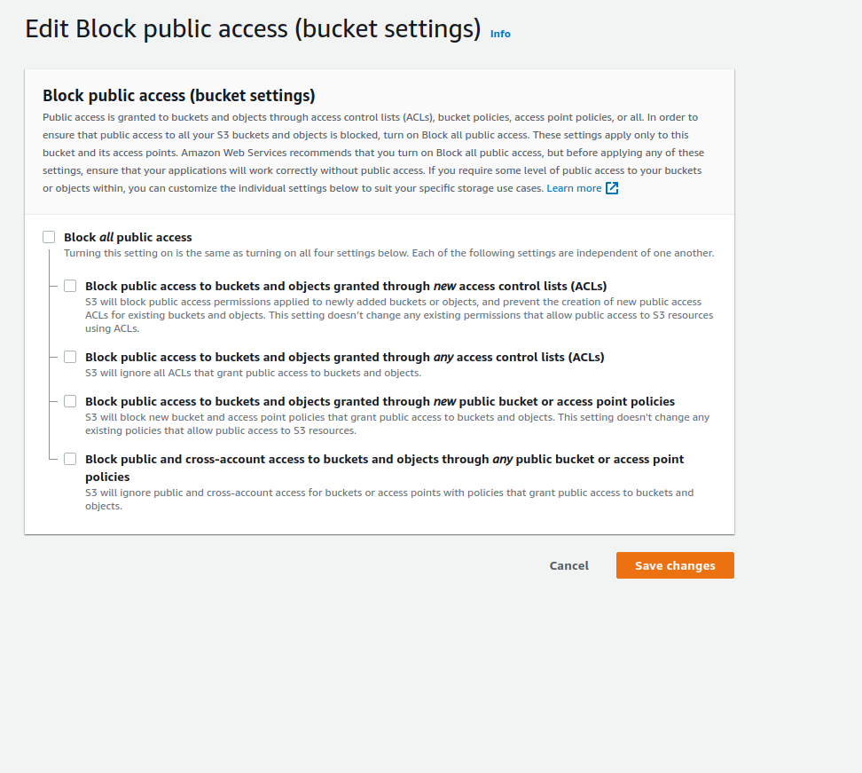

# 使用S3托管静态网站

静态网站是指不需要后端服务的网站, 比如个人博客, 个人简历, 个人作品集等. <br/>
这些网站的内容都是静态的, 不需要后端服务, 只需要将静态文件托管到一个服务器上即可.<br/>
本文将介绍如何使用AWS S3托管静态网站.

<!--truncate-->

## 创建s3桶

首先, 我们需要创建一个s3桶, 用于存放静态文件.

打开AWS控制台, 选择S3服务, 点击创建桶.

## 启用s3静态网站托管

进入s3桶, 点击`Properties`这个`Tab`, 在`Static website hosting`这个`Section`中点击`Edit`按钮.
界面如下:

填写必要的信息, 点击保存.

保存完成之后再次进入`Properties`这个`Tab`中, 在`Static website hosting`这个`Section`中可以看到`Bucket website endpoint`
已经显示出来了, 这个就是我们的静态网站地址.

## 公开桶

默认情况下, s3是私有的, 无法通过公网访问. 我们需要将桶设置为公开, 以便通过公网访问.

进入s3桶, 点击`Permissions`这个`Tab`, 在`Block public access (bucket settings)`这个`Section`中点击`Edit`按钮, 界面如下:

取消`Block all public access`的勾选, 点击保存.

另外还需要设置`Bucket policy`, 在`Bucket policy`这个`Section`中点击`Edit`按钮, 输入如下配置后保存.

:::note
将`Bucket-Name`替换为自己的桶名称
:::

```json
{
	"Version": "2012-10-17",
	"Statement": [
		{
			"Sid": "PublicReadGetObject",
			"Effect": "Allow",
			"Principal": "*",
			"Action": [
				"s3:GetObject"
			],
			"Resource": [
				"arn:aws:s3:::Bucket-Name/*"
			]
		}
	]
}
```

## 上传静态文件

通过`aws-cli`或者`web-console`上传静态文件到s3桶中.

## 参考资料

- [Hosting a static website using Amazon S3](https://docs.amazonaws.cn/en_us/AmazonS3/latest/userguide/WebsiteHosting.html)
- [Setting permissions for website access](https://docs.aws.amazon.com/AmazonS3/latest/userguide/WebsiteAccessPermissionsReqd.html)